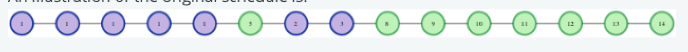

# Long Break

## Problem Description

"You are organizing an event where there will be a number of presenters. The event starts at time 0 and time is allocated for networking at any time during the event when there is not a presentation being made. The presentations may not overlap as they are in the same room, but this allows them to run consecutively, without breaks. While the order of speeches cannot be changed, there is a maximum number given that indicates how many speeches may be rescheduled. Your goal is to maximize the length of the longest networking period you can arrange.

For example, there are n = 4 presenters scheduled for the course of the event which begins at time 0 and ends at time t = 15. The meetings start at times start = [4, 6, 7, 10] and end at times finish = [5, 7, 8, 11]. You can rearrange up to k = 2 meetings. Green cells are free, marked with the hour number, and blue cells have a presentation scheduled, marked with presentation number.


In this case, we have 4 periods without speakers scheduled: [(0-3), (5), (8-9), (11-14)]. The meeting ends after hour 14. If the first meeting is shifted to an hour later, a break is created from 0 to 5, 5 hours. If the last speech is moved up to 8, it will end at 9 leaving a break from 9 to 15. There is no point to moving the middle two speeches in this case. The longest break that can be achieved is 15 - 9 = 6 hours by moving the last speech to two hours earlier. The two options are illustrated below.

Option 1:


Option 2:


### Task

* Given a series of presentations with their start and end times, you can rearrange up to `k` presentations.
* Your goal is to maximize the length of the longest networking period.

### Inputs

* `n`: Number of presentations.
* `k`: Maximum number of presentations that can be rearranged.
* `t`: The total duration of the event.
* `start[]`: An array of integers representing the start times of each presentation.
* `finish[]`: An array of integers representing the end times of each presentation.

### Output

* An integer representing the length of the longest possible break (networking period).

### Example

#### Input

```
n = 4
k = 2
t = 15
start = [4, 6, 7, 10]
finish = [5, 7, 8, 11]
```

#### Step-by-step Execution

1. The initial breaks are:

   * \[0, 4) -> 4 hours
   * \[5, 6) -> 1 hour
   * \[8, 10) -> 2 hours
   * \[11, 15) -> 4 hours

2. You can move up to 2 presentations.

3. By moving the last presentation to start at 8, it creates a longer break of 6 hours from 9 to 15.

### Sample Case

#### Input

```
3
2
15
0 6 7
5 7 8
```

#### Output

```
8
```

### Explanation

* The presentations were moved to maximize the largest break, creating an 8-hour break.

An illustration of the original schedule is:



Move the [6, 7] to [5, 6] and [7, 8] to [6, 7]. Then [7, 14] is a break, and its duration is 8.


### Constraints

* `1 ≤ n ≤ 10^5`
* `0 ≤ k ≤ n`
* `1 ≤ t ≤ 10^9`
* `0 ≤ start[i] < finish[i] ≤ t`
* `finish[i] ≤ start[i + 1]` for `i < n - 1`

## Function Description

Complete the function `findBreakDuration` with the following parameters:

```python
findBreakDuration(n: int, k: int, t: int, start: List[int], finish: List[int]) -> int
```

* `n`: The number of presentations.
* `k`: The maximum number of presentations that can be rearranged.
* `t`: The end time for the event.
* `start`: A list of integers representing the start times of presentations.
* `finish`: A list of integers representing the end times of presentations.
