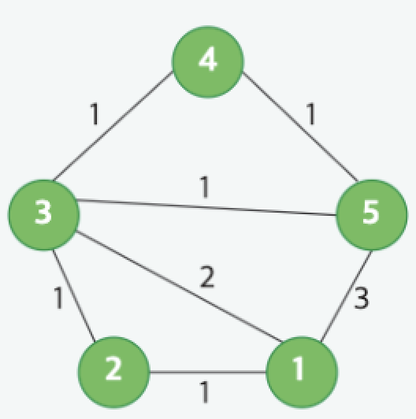

# Checking Your Route

## Problem Description

A ride hailing company sometimes travels between cities. To avoid delays, a driver first checks for the shortest routes. There is a map of the cities and their bidirectional roads represented by a graph of nodes and edges. Determine the paths from the first node to the last node and choose the shortest length. Now select all paths that are that length. These are the shortest paths. Return an array of strings, one for each road in order, where the value is YES if the road is along any shortest path or NO if it is not. The roads or edges are named using their 1-based index within the input arrays.

### Example

Given a map of `g_nodes = 5` nodes, the starting nodes, ending nodes, and road lengths are:

```
Road    from/to/weight
1        (1, 2, 1)
2        (2, 3, 1)
3        (3, 4, 1)
4        (4, 5, 1)
5        (5, 1, 3)
6        (1, 3, 2)
7        (5, 3, 1)
```

It is represented in the graph below.



### Shortest Path Analysis

* The traveler must travel from city 1 to city `g_nodes`, so from node 1 to node 5 in this case.
* The shortest path is 3 units long and there are three paths of that length:

  * `1 → 5`
  * `1 → 2 → 3 → 5`
  * `1 → 3 → 5`
* Return an array of strings, one for each road in order, where the value is YES if a road is along a shortest path or NO if it is not. In this case, the resulting array is:

```
['YES', 'YES', 'NO', 'NO', 'YES', 'YES', 'YES']
```

### Function Description

Complete the function `classifyEdges` in the editor below.

```python
classifyEdges(g_nodes: int, g_from: List[int], g_to: List[int], g_weight: List[int]) -> List[str]
```

#### Parameters

* `g_nodes`: an integer, the number of nodes
* `g_from`: an array of integers, the start g\_nodes for each road
* `g_to`: an array of integers, the end g\_nodes for each road
* `g_weight`: an array of integers, the lengths of each road

### Returns

* `List[str]`: an array of strings where the value at `i`th index is YES if the i-th edge is a part of a shortest path from vertex 1 to vertex g\_nodes. Otherwise it should contain NO.

### Constraints

* `2 ≤ g_nodes ≤ 3000`
* `1 ≤ g_edges ≤ min(10^5, (g_nodes × g_nodes - 1)/2)`
* `1 ≤ g_weight[i] ≤ 10^5`
* `1 ≤ g_from[i], g_to[i] ≤ g_nodes`
* The graph is connected.

### Sample Case

#### Input

```
4 5
1 2 1
1 3 1
3 4 1
4 2 2
4 1 2
```

#### Output

```
YES
YES
NO
NO
YES
```
